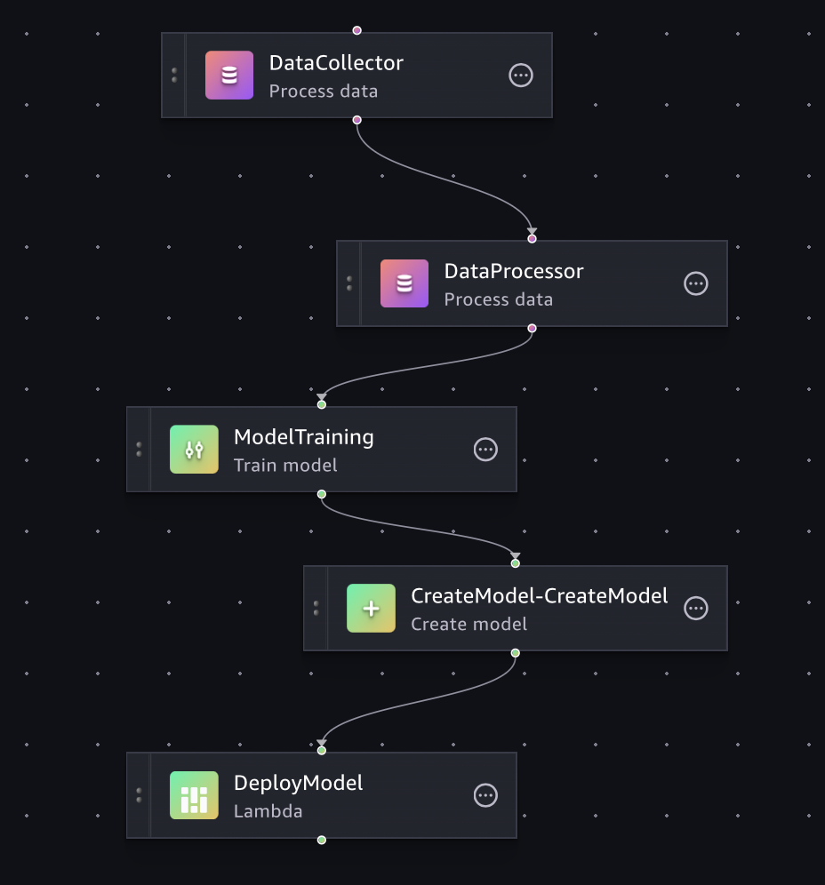
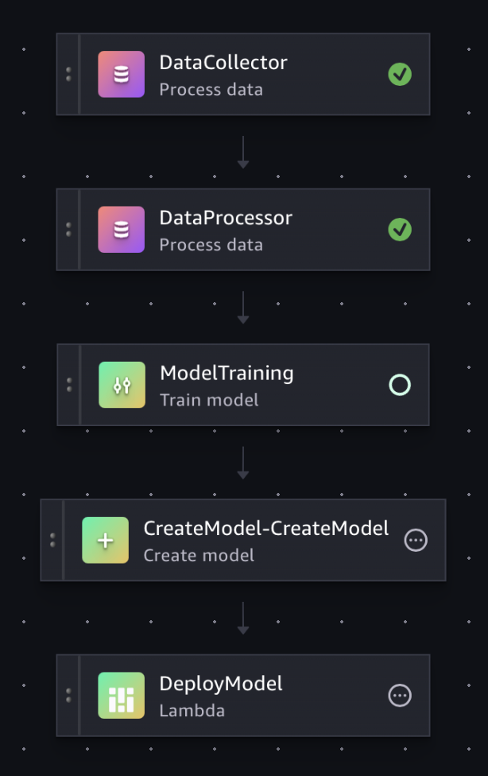
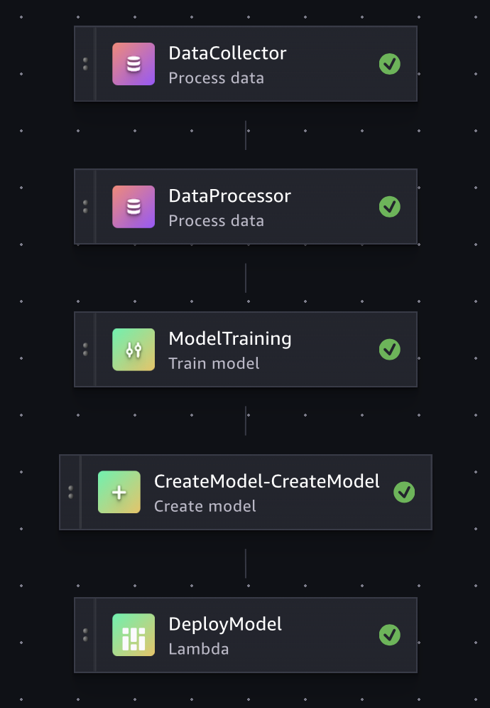

# Cheese App: ML Workflow Management

In this tutorial we will put all the components we built for our Cheese App together. We will then apply workflow management methods to test, execute, monitor, and automate these components:
* Data Collector: Gathers images from the internet and stores them into a `raw` folder.
* Data Processor:  Removes duplicate images, validates formats, and converts images into TFRecord format.
* Model Training: Submits training jobs to Amazon Sagemaker AI to train the models.
* Model Deploy: Updates the model signature with preprocessing logic, then uploads the model to the Amazon SageMaker AI Model Registry and deploys it as an endpoint.



## Setup Environments
In this tutorial we will setup a container to manage packaging python code for training and creating jobs on SageMaker Pipelines to run training tasks.


### Clone the github repository
- Clone or download from [here](https://github.com/dlops-io/ml-workflow-aws)

### AWS Services
Search for each of these in the AWS console. You will need to enable some of these services. The rest are listed for you to become familiar with the services you will use throughout this project.
* Amazon SageMaker AI -> Set up for single user (Quick setup)
* Amazon SageMaker Unified Studio AI -> Create domain
* Amazon S3 -> Create bucket for ML workflow storage
* Amazon ECR -> For container image registry
* AWS Lambda -> For automated model deployment

### Create S3 Bucket

We need a bucket to store files that we will be used by SageMaker Pipelines during the ML workflow.
- Go to Amazon S3
- Create a bucket `cheese-app-ml-workflow-demo` [REPLACE WITH YOUR BUCKET NAME]


### Setup AWS Credentials

#### Create IAM User
1. AWS Console → Search "IAM" → Users → Create user
2. User name: `ml-workflow-user` → Next
3. Attach policies directly → Select:
   - `AmazonS3FullAccess`
   - `AmazonSageMakerFullAccess`
   - `AmazonEC2ContainerRegistryFullAccess`
   - `AWSLambda_FullAccess`
4. Next → Create user

#### Create Access Keys
1. Click on `ml-workflow-user` → Security credentials tab
2. Access keys → Create access key → Command Line Interface (CLI)
3. Check confirmation → Next → Create access key
4. **Download .csv file** (contains Access Key ID and Secret Access Key)

#### Install AWS CLI
**macOS:** `brew install awscli` or download installer from AWS
**Linux:** `sudo snap install aws-cli --classic` or use curl installer

#### Configure AWS CLI
```bash
aws configure
```
Enter when prompted:
- **Access Key ID:** [from downloaded .csv]
- **Secret Access Key:** [from downloaded .csv]  
- **Default region:** `us-east-1` [YOUR DEVELOPMENT REGION]
- **Default output format:** `json`

#### Test Configuration
```bash
aws sts get-caller-identity
aws s3 ls
```

#### Create IAM Roles
**SageMaker Role:**
1. AWS Console → IAM → Roles → Create role
2. AWS Service → SageMaker → SageMaker - Execution → Next
3. Name: `CheeseAppSageMakerExecutionRole` → Create Role
4. Add policies: `AmazonSageMakerFullAccess`, `AmazonS3FullAccess`, `AmazonEC2ContainerRegistryFullAccess`

**Lambda Role:**
1. Create role → AWS Service → Lambda → Next
2. Add policies: `AWSLambda_FullAccess`, `AmazonSageMakerFullAccess`
3. Name: `CheeseAppLambdaExecutionRole` → Create Role

<hr> 

<hr> 


## Run Data Collector Container & Test CLI  & Test CLI
#### Run `docker-shell.sh`
The startup script is to make building & running the container easy


- Make sure you are inside the `src/data-collector` folder and open a terminal at this location
- Run `sh docker-shell.sh`

#### Test Data Collector

* Run `python cli.py --search --nums 10 --query "brie cheese" "gouda cheese" "gruyere cheese" "parmigiano cheese"`
* Go and check your S3 bucket to see if `raw.zip` was uploaded. 


<hr> 

<hr> 

##  Run Data Processor Container & Test CLI
#### Run `docker-shell.sh`
The startup script is to make building & running the container easy


- Make sure you are inside the `src/data-processor` folder and open a terminal at this location
- Run `sh docker-shell.sh`

#### Test Data Processor

* Run `python cli.py --clean`
* Go and check your S3 bucket to see if `clean.zip` was uploaded. 
* Run `python cli.py --prepare`
* Go and check your S3 bucket to see if `tfrecords.zip` was uploaded. 

<hr> 

<hr> 

## Run Model Training Container & Test CLI
#### Run `docker-shell.sh`
The startup script is to make building & running the container easy

- Make sure you are inside the `src/model-training` folder and open a terminal at this location
- Run `sh docker-shell.sh`

#### Test Model Training

##### Local Training
* Run `python -m package.trainer.task --epochs=1 --batch_size=4 --bucket_name=cheese-app-ml-workflow-demo`
##### Remote Training
* Run `sh package-trainer.sh`, this will package the trainer code and upload into a bucket
* Run `python cli.py --train`, this will invoke a SageMaker training job

#### Monitor Training Jobs in AWS Console
* Go to Amazon SageMaker AI Console
* Click **"Training"** → **"Training jobs"** in the left sidebar
* Find your training job (starts with `cheese-`)
* Click on the job name to view details, logs, and metrics


<hr> 

<hr> 

## Build & Push Images
This step has already been done for this tutorial. But for completeness here are the steps. 

### Pushing Docker Image to Docker Hub
Required images: `cheese-app-data-collector` and `cheese-app-data-processor`

* Sign up in Docker Hub and create an [Access Token](https://hub.docker.com/settings/security)
* Login to the Hub: `docker login -u <USER NAME> -p <ACCESS TOKEN>`
* Build and Tag the Docker Image: `docker build -t <USER NAME>/<IMAGE_NAME> -f Dockerfile .`
* If you are on M1/2 Macs: Build and Tag the Docker Image: `docker build -t <USER NAME>/<IMAGE_NAME> --platform=linux/amd64/v2 -f Dockerfile .`
* Push to Docker Hub: `docker push <USER NAME>/<IMAGE_NAME>`

### Pushing Docker Image to Amazon ECR
Required images: `cheese-app-data-collector` and `cheese-app-data-processor`

**Set Environment Variables (replace with your values):**
```bash
export REGION=us-east-1 [YOUR DEVELOPMENT REGION]
export ACCOUNT_ID=$(aws sts get-caller-identity --query Account --output text)
export REPO=cheese-app-data-collector  # or cheese-app-data-processor
export TAG=latest
export ECR_URI="$ACCOUNT_ID.dkr.ecr.$REGION.amazonaws.com/$REPO:$TAG"
```

**Push to ECR:**
```bash
# 1) Pull from Docker Hub (if needed)
docker pull <YOUR_DOCKER_HUB_USERNAME>/$REPO:$TAG

# 2) Create ECR repository
aws ecr create-repository --repository-name "$REPO" --region "$REGION" || true

# 3) Authenticate Docker to ECR
aws ecr get-login-password --region "$REGION" \
| docker login --username AWS --password-stdin "$ACCOUNT_ID.dkr.ecr.$REGION.amazonaws.com"

# 4) Tag image for ECR
docker tag <YOUR_DOCKER_HUB_USERNAME>/$REPO:$TAG "$ECR_URI"

# 5) Push to ECR
docker push "$ECR_URI"

# 6) Verify push
aws ecr list-images --repository-name "$REPO" --region "$REGION" --output table

# 7) Get final ECR URI
echo "ECR URI: $ECR_URI"
```

**Repeat for both images:**
- `cheese-app-data-collector`
- `cheese-app-data-processor`

<hr> 

<hr> 


## Automate Running Data Collector Container

In this section we will run the data collector as a standalone SageMaker Processing job.

### In the folder `workflow` Run `docker-shell.sh`
The startup script is to make building & running the container easy

- Make sure you are inside the `src/workflow` folder and open a terminal at this location
- Run `sh docker-shell.sh`

### Run Data Collector as SageMaker Processing Job
In this step, we'll run the data collector container as a standalone SageMaker Processing job. This demonstrates running individual components before orchestrating them in a full pipeline.

* Run `python cli.py --data_collector`, this will run the data collector ECR image as a SageMaker Processing job
* Go to Amazon SageMaker AI → Processing → Processing Jobs to inspect the status of the job

## Cheese App: SageMaker Pipelines
In this section we will use SageMaker Pipelines to automate running of all the tasks in the cheese app

### Run Workflow Pipeline in SageMaker
In this step we will run the workflow as serverless tasks in SageMaker Pipelines.

#### Entire Pipeline
* Run `python cli.py --pipeline`, this will orchestrate all the tasks for the workflow with Lambda-based deployment.
* Go to Amazon SageMaker → Amazon SageMaker Unified Studio AI → Build → ML Pipelines to inspect the status of the pipeline

You should be able to see the status of the pipeline in SageMaker similar to this:


<br>



#### Test Specific Components

* For Data Collector: Run `python cli.py --data_collector`
* For Data Processor: Run `python cli.py --data_processor`
* For Model Training: Run `python cli.py --model_training`
* For Model Deploy: Run `python cli.py --model_deploy`
